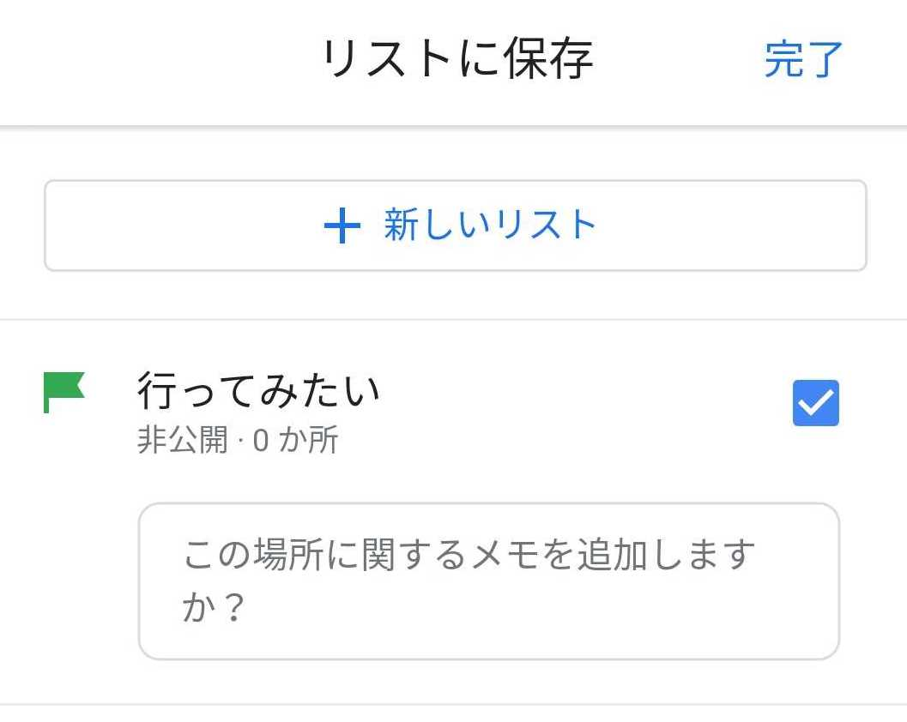
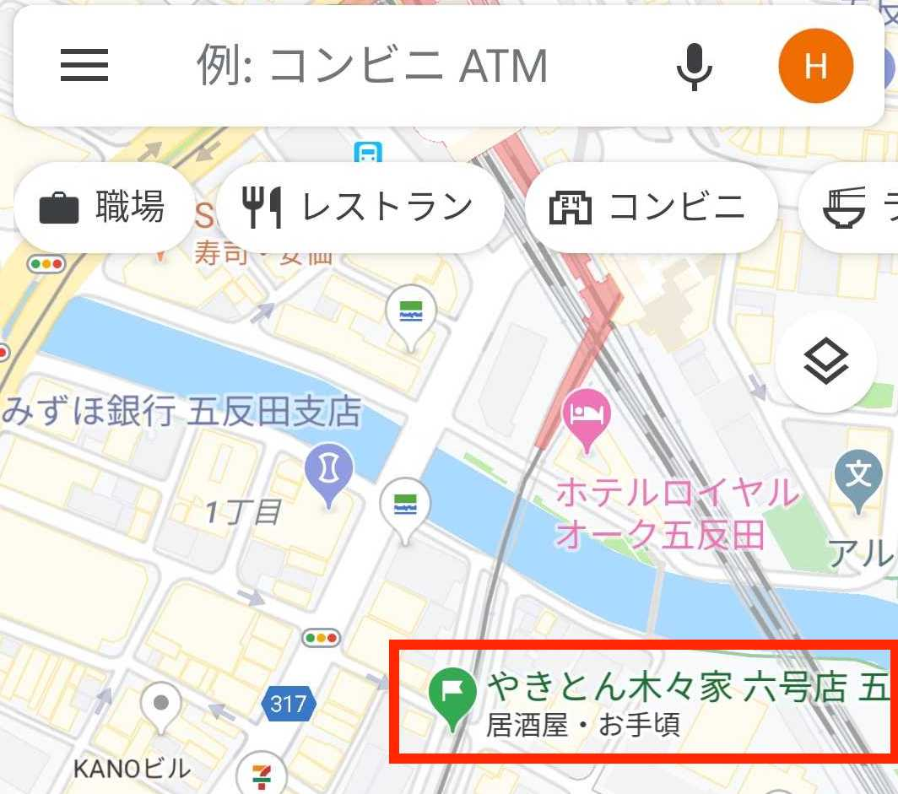
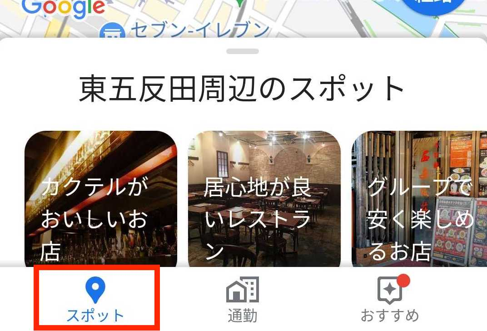
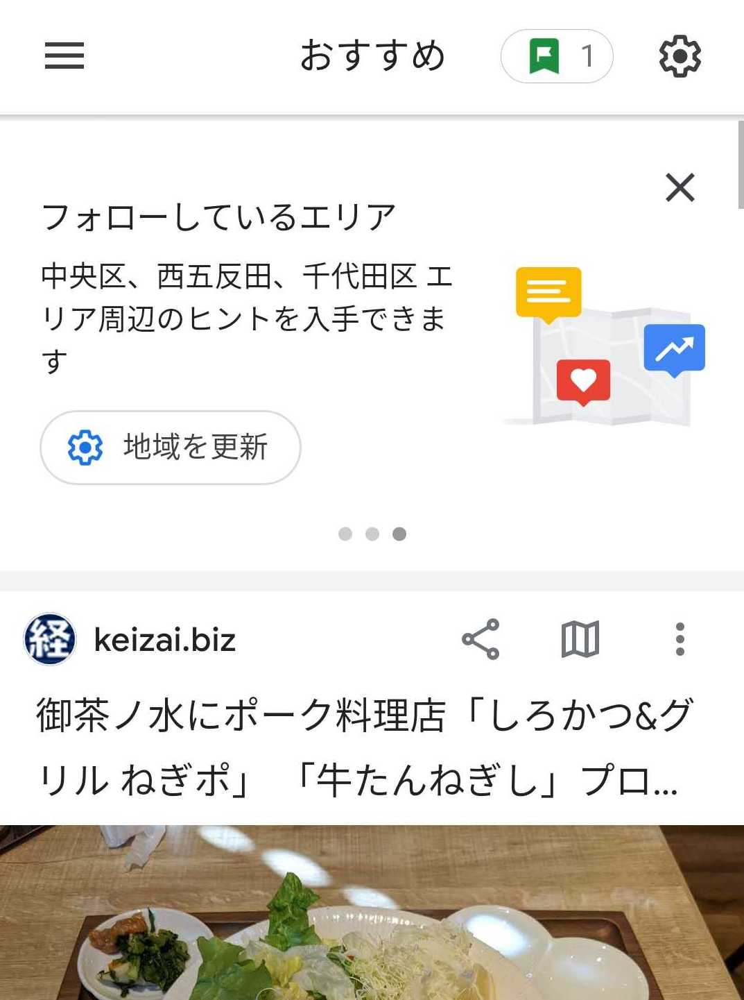
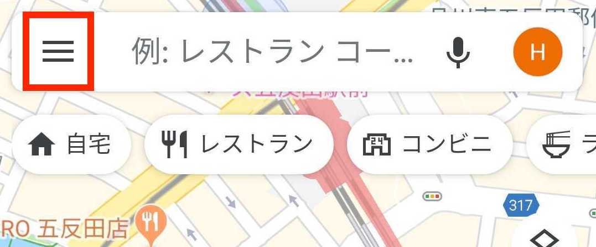
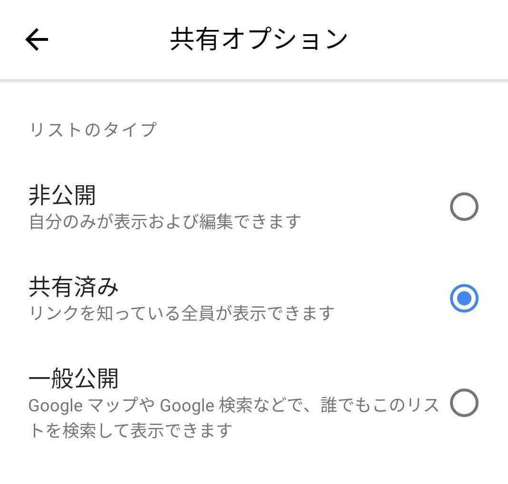
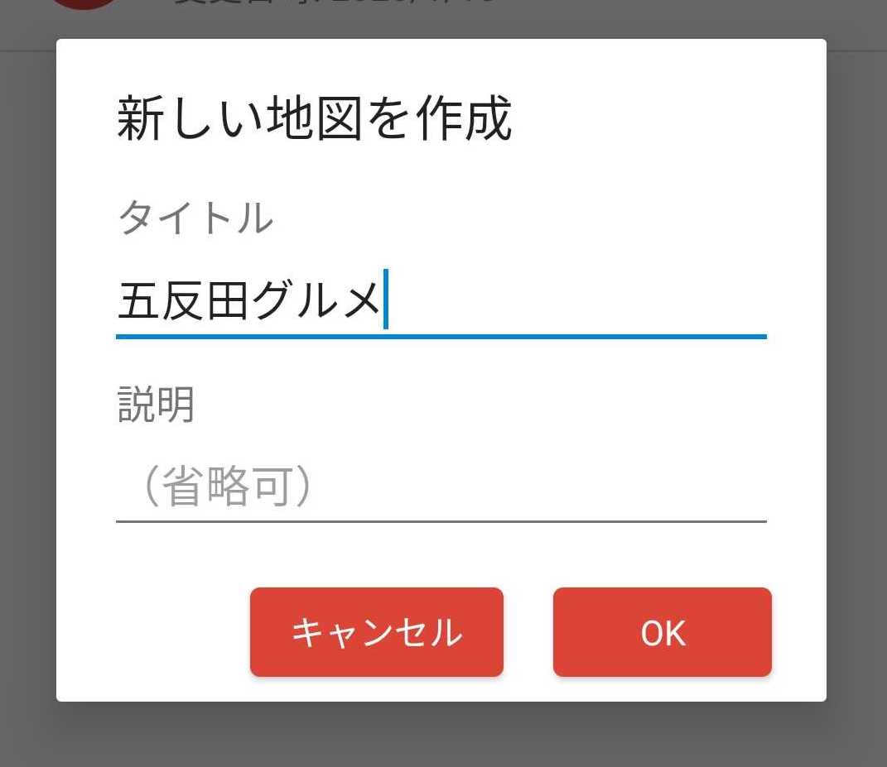
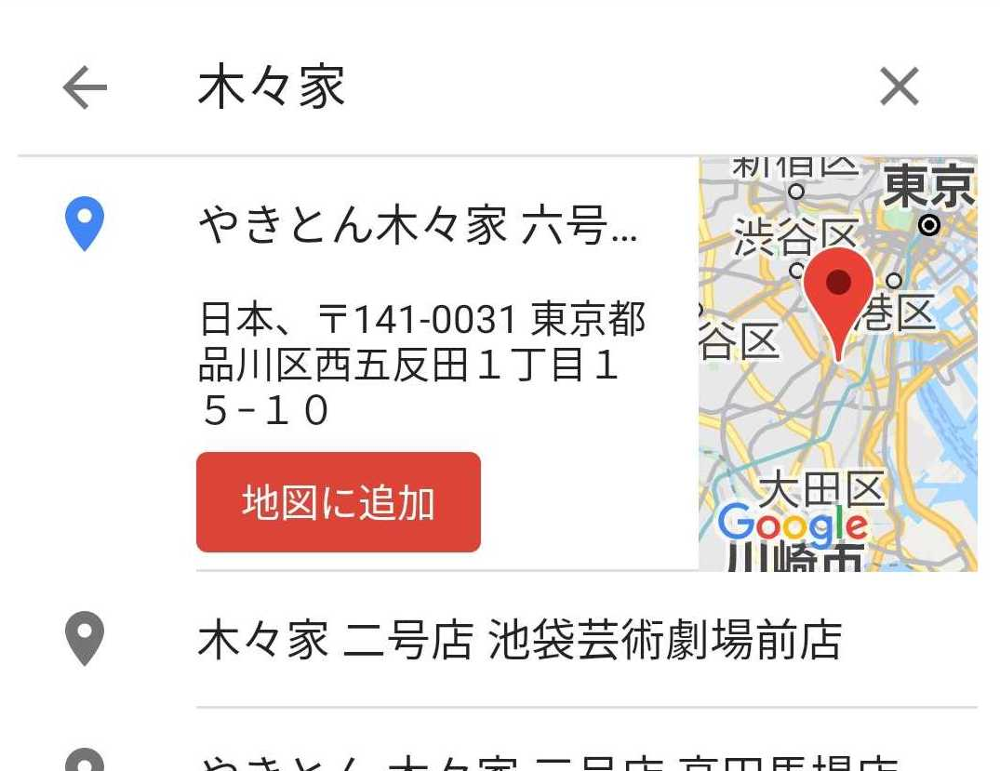

# 飲み会を支える技術

## 書こうと思った理由

こんにちは。まずはこの本を手に取っていただきありがとうございます。
株式会社マツリカでバックエンドエンジニアをしているのりへいと申します。

本章は「飲み会をいかに楽しく円滑に行うか」に再現性を持たせようという内容です。少しばかりのポイントを押さえ、テクノロジーとうまく付き合うことによって飲み会をほんの少し楽しくするためのテクニックをお伝えしたいと思います。

こんな内容を書くぐらいなので筆者は飲み会が好きです。ただしお酒に強いわけではありません。お酒は好きですが 2時間で4杯ほどがせいぜいの許容量ですし、1杯も飲めば心配されるほど顔が赤くなります。
それでも飲み会が好きなのは、単に食事やお酒が好きなだけでなく、飲み会を通じて気付きやチャンスを得られることや、参加している人たちの人柄を知ったり、自分自身の気持ちに気づいたりすることでエネルギーをもらえることがあるためです。

世間的には飲み会とは、特に職場が関連する場合に、つまらないもの、辛いものという印象を持たれがちなように思います。飲み会を楽しく、苦痛の少ないものにし、円滑に行えるような工夫を伝えることで飲み会からなんらかの良い影響を得る人が少しでも増えればいいなと思い、この章を書くことにしました。

### 飲み会は強制でつまらない？

少し前の忘年会シーズンに「忘年会スルー」という言葉がTwitterでバズったそうです。NHKで取り上げられてTwitterでも話題になったんだとか。
いわく、「高いお金を払って聞きたくもないつまらない話を聞かされる」、「準備が大変」、「何を話していいのかわからない」とのことで、テレビの放送を見た限りでは「飲み会自体が今どき流行らない」という文脈で話されているようにも感じました。

ですが冷静に考えると上記の内容は「聞きたくもないつまらない話」をしてしまう人自身の問題や、共通の話題がないなどに起因しており、飲み会そのものの問題ではないはずです。
「準備が大変」については同意する部分もありますが、大変さを軽減したり、準備を楽しめるような方法であればお伝えできるかと思います。

本当に世間でイメージされているほど飲み会ってつまらないものなのでしょうか。少なくとも筆者はそう考えてはいません。

### 飲み会は楽しくできる

マツリカではフルリモートの勤務が許可されており、遠く離れたところに住んでいるメンバーも多数います。そうしたリモートメンバーともコミュニケーションを取りたいと、2 年ほど前からビデオチャットツールのzoomを活用して不定期に「リモート飲み会」を開催しています。
要はみんな自宅で好きに飲みながら話しているというだけなのですが、別に会社が提案して始めたものでもなく、社員がやりたいと言って始めたものです。
上記の「忘年会スルー」について、変わった忘年会の一種としてマツリカのリモート飲み会も取り上げられましたが、「少しでも飲み会の参加者を増やそうとする試み」かのように紹介されたことに違和感を覚えました。
マツリカは飲み会好きが多く、週に4回会社のメンバーと飲んでいるということもそれほど珍しくはありません。もちろん任意参加ですが、毎度みんな楽しそうに話しています。

少しの配慮と工夫さえあればみんなで飲み会を楽しくすることはできます。

### 飲み会からチャンスが広がることもある

筆者が飲み会が好きな理由は単に人と話すのが楽しいというのももちろんありますが、加えて新たな気付きやチャンスを得られることがあるというのもあります。
飲み会で話していることが壁打ちとなって考えが整理されたり、自分が気づいていなかった視点をもらえたり、そのことがきっかけで新たな挑戦への後押しをしてもらえることもあります。

この章を書いていること自体、同僚に誘われた飲み会に参加したおかげでもあります。
マツリカの同僚である FORTEさん(@FORTEgp05)とえるきちさん(@erukiti)が参加されている技術同人サークル、親方Project の飲み会に参加させていただいたことがありました。
サークル主である親方さん(@oyakata2438)に飲み会を支える技術というテーマで書こうと思っているという話をし、それをまとめていただけたことで自分が書きたかったテーマを整理することができました。

この体験を通じて自分の中には発信できるネタがあるということ、発信するというのは自分が思っているよりも遥かに気軽に始められることなのだと背中を押されましたし、発信することの楽しさについて、実際に発信している人たちの生の声や表情を知ることができたことによってもっと発信してみたいと興味を引かれました。

もちろんこうした経験は飲み会でなくともできるでしょう。ですが、おいしいご飯やお酒はコミュニケーションを円滑にしてくれます。
より本音に近い形で話したり相談したりすることはきっと様々な経験やエネルギーをもたらしてくれるでしょう。

こうした新しい場に参加するだけでなく、同僚や上司、直接の関係にない部署の人と飲み会に行くのも新しい視点を得たり、モチベーションにつながったりします。
仕事の悩みを相談したり、同じ職場の仲間がどんなことを考えて働いているのかを知ることで、より広い視点で業務を捉え直し、より良く改善するチャンスに気づくこともあります。
また、人間は自分以外の誰かのためにがんばることもできるものです。仲間の素顔や新たな一面を知ることによって日々の業務で頑張ろうと思えるポイントが増えるかもしれません。

このように、飲み会を楽しくできるようになればもっとチャンスは広がるはずです。

## 計画編

この章では飲み会を計画する際に気をつけた方がいいことや、計画を楽にするためのコツなどについてお伝えします。
飲み会に限った話ではありませんが、多くのものごとは事前準備の質によって成否が大きく左右されます。
とはいえ気負う必要はありません。慣れてしまえば押さえるべきところだけ押さえてうまく楽をできるようになります。

また、計画段階で考慮すべきことは会の規模とフォーマルさに左右されます。
この章では多くのことをお伝えしますが、必要に応じて内容を取捨選択していただくとよりうまく使っていただけると思います。

### 3 パターンの計画方法

飲み会の計画は大まかには目的、参加者または日程、場所の3つのいずれかが決まることによってスタートすることが多いでしょう。
いずれか1つを決めて、その後残りの要素を決めながら計画を詰めていくことになります。

#### 目的ありき

目的、つまりは食べたいものや飲みたいものなどが決まることから始まるなどの場合です。
目的ありきで決める場合は日頃からいろいろなお店の情報を集めていると提案もしやすくなります。日頃からお店の情報を効率よく集める方法については後述します。

#### 参加者・日程ありき

友人同士のLINEグループで飲み会が決まるなどのパターンです。誰と飲みたいや、何日に飲みたいなどから始まります。
新しく入社された方の歓迎会などもここに分類されます。入社された方の入社日に合わせて部署のメンバーでという具合ですね。
そのほかには正月など帰省が重なるタイミングでの会も該当するでしょう。

日程を決めるときには調整さん(https://chouseisan.com/)を利用すると便利です。
LINEの日程調整機能でも同様のことができるので、参加者のLINEのIDをすでに交換している場合にはこちらでもいいかもしれません。

#### 場所・エリアありき

特定のお店に行きたい、どこかに行ったついでに近辺で飲みたい、業務後に会社のメンバーで飲みたいなどの場合です。
ライブ後のオフ会など、特定にエリアなら集まりやすいことが事前に分かっているというのもこのパターンに当てはまります。

### コンセプト・目的を決めよう

会のコンセプトや目的はできるだけ早いうちに決めてしまいましょう。
飲み会のコンセプトや目的を明確に決めておくことで目的そのものを楽しむことができるため、人を誘いやすくなる、誘われた人が参加しやすくなる、誘う人のイメージを明確にしやすくなる、場所決めなどの計画の詳細を決めやすくなるなどのメリットがあります。
目的が明確であれば参加する理由が明確になり、招待を受け取った人の意思決定をしやすくしてあげることにもなります。

コミュニケーションをメインとするのか、食べ物や飲み物がメインになるのかなどです。
例えばコミュニケーションを主な目的とするのであれば、参加者を極力増やすことやコミュニケーションを取りやすいような会場選びを目指すことになるため、以降の計画は参加者が参加しづらい理由をいかに減らしていけるか、お店は騒がしすぎないかなどの条件が肝要となります。
食べ物や飲み物がメインなのであれば上記のような項目よりも、目当てとするものが確実に食べられるのか、よりおいしく食べられるお店はどこかなどの方が重要になるでしょう。

### 参加者の属性を知ろう

参加者のことを知っておくことも重要です。ここでどれだけ検討を重ねられたかが会の楽しさをどれだけ積み増せるか、より参加しやすいと思ってもらえるかにつながってきます。

好きな食べ物や飲み物を知っておけばお店を決めたりおつまみを用意する際の参考になるでしょう。
そしてそれ以上に、嫌いなものやアレルギーの有無は重要です。

以前、お世話になった方を友人数名でもてなそうとイタリアンの美味しいと評判のお店を予約したのですが、お店に入ってからその方が小麦アレルギーだということが分かりました。
コースを予約していたため今さら店を変えるわけにもいかずなんとか食べられるものだけをつまみつつも、ほとんど何も食べられずお互いに申し訳なさそうな顔で食事をするという気まずさはなかなかのものでした。

参加者がどこに住んでいるのかというのも大事な情報です。極力みんなが参加しやすいまたは帰り道のアクセスがいいエリアはどこかを考えることによって参加しやすくすることができます。
そのほかにはタバコが苦手な人がいる場合には分煙できるかどうかも確認した方がいいでしょう。特に喘息がある人や匂いに敏感な人にとってはタバコの煙は想像以上に辛いものです。

### 会場の要件を決めよう

ここまでで判明した情報を基にして会場が満たすべき要件を決めましょう。
必須要件と望ましいものとの切り分けもできれば、よりスムーズに絞り込みが行えます。
以下のような項目を決めておけば絞り込みやすいでしょう。

- どの駅の辺りがいいのか、またはどの路線の沿線が望ましいのか
- 静かな方がいいのかそれとも多少は騒がしくてもいいのか
- 喫煙は可能な方がいいのか、分煙されている必要があるのか。
  - タバコのルールは厳しくなってきているため、愛煙家も嫌煙家も楽しめるように事前に考えておく
- 駅からは徒歩何分程度か、道はわかりやすいか
  - 雨が降る可能性や荷物が多くなりがちな場合は近くて分かりやすいに越したことはない

### どこから決めてもいい

ここまで会場の絞り込み条件を考える上で検討した方がいい要素を挙げてきましたが、これらはどの順番で決めても問題ありません。
1つが決まることで他の条件を決めやすくなることもありますし、いくつかの条件が並行で決まっていくこともあるでしょう。
会場を絞り込む時点で条件を煮詰められていれば計画のほとんどは完了しているも同然です。

### 詳細を決めよう

そのほかに決めておけるとより良い項目は以下のようなものです。

#### お会計の集め方

現金のみか電子決済も利用可能なのかは先に決めて伝えておけると非常に親切です。
電子決済が可能な場合は細かい金額のやりとりも簡単なためメリットが大きいのですが、使っていない人の方がまだまだ多いでしょう。

LINE pay、PayPay、Kyashなどが利用できれば集金でも支払いでもまず対応できるでしょう。
口座連携や現金化が可能であり、利用可能な店舗も多いため、人にも勧めやすいサービスです。

#### 目安の予算

飲み会に使ってもいいと思える金額の幅は人やその時の状況によります。
家飲みなどであれば先に予算を決めておくこともできるでしょう。
お店で飲む場合、コースなら金額が明確ですし、そうでない場合も食べログなどに掲載されている目安の幅だけでも伝えておけると気兼ねなく参加しやすくなります。

#### 開始時間と終了時間

開始だけではなく終了予定時間も知っておけるとより気楽に参加できるようになります。

#### 二次会の有無

二次会を行うかどうかを事前に伝える必要のあるほどフォーマルな会はそれほど多くはないとは思いますが、事前に知らされていれば参加者としてはお金を余分に用意することもできますし、開催側も誘導がスムーズになるというメリットがあります

### 要件の優先順位を決めよう

ここまでで飲み会を開くために必要なほとんどの情報は揃ったかと思います。
会場の要件に加えて会そのものの要件や考慮すべきことも加わりました。これらの情報の中で必須のものと望ましい程度のものとを改めて分けましょう。
必須要件は可能な限り少なくし、望ましいものについては優先順位を明確にできると、その後やるべきことがクリアになりやすいです。

## 外飲み編

### お店の情報を溜め込もう

お店の情報は会を開くことが決まってから集めることが多いと思いますが、日頃から集めておくといざというときにすぐにお店の候補が出せますし、行ってみたい場所が増えるほど外出が楽しくなったり人を誘う機会も増えたりするのでおすすめです。
筆者は気になるスポットの情報はGoogleマップを使って記録しています。
行ってみたい場所が近くにあれば通知してくれますし、人に共有するのも簡単に行えます。

#### リストの作り方

リストの作り方は簡単で、気になるスポットに対してリストのラベルを付与するだけです。
Googleマップにはデフォルトで「行ってみたい」と「お気に入り」のリストが用意されており、そのほか任意でリストを追加することができます。

ここではマツリカのメンバーがよく利用している五反田のやきとん屋を行ってみたいリストに追加します。
まずはお店を検索しましょう。

リストに追加したい場所の名前の辺りをタップします。

お店の詳細情報などが表示されたら、「保存」のアイコンをタップします。

「リストに保存」の画面が表示されます。
「行ってみたい」ラベルをタップしましょう。このときメモを追加することも可能です。

追加したいラベルを全て選択したら完了をタップしましょう。これでリストへの追加が完了です。

地図上でラベルがついていることが確認できます。

なお、「行ってみたい」リストに追加されているお店が近くにある時は Google マップが通知を出してくれるため、日頃から気になるお店はどんどんリストに追加しておくと良いでしょう。

また、ラベルは自由に作成することができます。
「焼き鳥・やきとん」というリストを作成し、先ほどのお店を追加してみましょう。

先ほどと同様の手順で「リストに保存」の画面を立ち上げます。「＋新しいリスト」をタップしましょう。

リスト名を入力します。リストの説明を追加することももできます。
リスト名を入力したら「作成」をタップします。

リストに追加されました。

「地図を表示」をタップすれば、リストに登録されているスポットが地図上に表示されます。

保存したリストを確認するには、マップの左上にあるメニューアイコンをタップし、「マイプレイス」＞「保存済み」で確認できます。

ちなみに筆者は1つのお店を複数のリストに紐付けることをおすすめしています。
気になったお店を全て「行ってみたい」と「お気に入り」だけに追加した結果増えすぎてしまい、下図のように地図上だけではなんだかよく分からなくなってしまいました。
例えば「お気に入り」、「焼き鳥・やきとん」、「居酒屋」のように複数のリストに紐づいていれば、「現在地から近いお気に入りの店」や「五反田の焼き鳥屋」、その時必要な角度の情報によって検索が可能になります。

### お店の情報を集めよう

お店の情報を集める手段は様々にあります。ここでは筆者が情報源として利用しているものを取り上げたいと思います。

#### Google マップ

Googleマップも最近はレビューが充実してきており、お店を検索し、レビューを見てお店を決めるまでを非常にスムーズに行えるようになりました。
検索したいエリアを表示した状態で「居酒屋」や「カフェ」と検索すればそれでお店を見つけることもできます。

また、検索以外の方法でお店を見つけることも可能です。1つは「スポット」を利用する方法、もう1つはエリアをフォローしてフィードで情報を受け取る方法です。

スポットを利用する場合、Google マップアプリの左下にある「スポット」をタップします。
下図のように「カクテルがおいしいお店」や「居心地が良いレストラン」などが表示されるため、これらから気になるものをタップすればお店の候補が表示されます。

フィードから情報を受け取る場合、右下の「おすすめ」をタップします。現在フォローしているエリアにおけるお店の新規開店などの情報が表示されます。
フォローするエリアを追加する場合、右上の歯車のアイコンをタップすると現在フォローしているエリアや自分がよく訪れるエリアなどが表示されるので、ここでエリアを編集しましょう。

#### Instagram

Instagramもお店探しに非常に便利なツールです。

多数のグルメメディアのアカウントが存在し、それらをフォローするだけでも多くの情報が手に入ります。

特定の人物ではなくハッシュタグをフォローすることもできるため、例えば「五反田グルメ」のタグをフォローしておけば日常的に五反田のグルメ情報を得ることも可能です。
もちろん必要な時だけ検索するというやり方もできます。

また、たいていのジャンルにはインフルエンサーがいるため、そうしたアカウントをフォローすることで自分の好きなジャンルのお店についての情報が手に入りやすくなります。

#### キュレーションメディア・グルメ情報サービス

キュレーションメディアで知ったお店をこまめにGoogleマップに追加しておくと咄嗟の時でもお店探しが非常に簡単に行えます。
筆者は以下に挙げるメディアをよく見ています

- favy(https://www.favy.jp/)
- ヒトサラ(https://hitosara.com/)
- 食べログまとめ(https://tabelog.com/matome/)
- Rettyグルメニュース(https://retty.news/)
- aumoグルメ(https://gourmet.aumo.jp/)

ただし、ここで見つけたお店を実際に利用する前には食べログなどのレビューサービスで現在の情報を確認するようにしましょう。
掲載後に閉店したということもありえます。

これらのメディアを都度検索して追うのは難しいので、筆者はこれらの情報をRSSリーダーのfeedly(https://feedly.com/)にまとめて見ています。
feedlyの使い方についてはこの章のスコープからは少し外れるため解説しませんが、興味のある方は調べてみてください。

#### レビューサービス

じっくりとお店探しができるときにはレビューサービスを利用すると良いでしょう。
食べログ(https://tabelog.com/)や Retty(https://retty.news/)などのサービスを利用されている方も多いと思います。
最近ではSARAH(https://sarah30.com/)というサービスも有力な手段です。
SARAHはお店のジャンルではなく、特定のメニューにフォーカスしたレビューサービスで、例えば「五反田 ポテトサラダ(明太子)」と検索すると、五反田周辺で明太子入りのポテトサラダの中で最もレビューが高いのはどのお店のものなのかということが検索できたりします。

### お店を絞りこもう

計画段階で整理した情報を元にお店の候補を絞り込みましょう。
望ましい条件の優先順位に沿っていけば3つ程度までには絞り込めると思います。
全て同程度に良いということはなかなかなく、例えば目安の予算やお店と駅との距離、内装のきれいさなど何かしらの違いはあるはずです。
条件の優先順位が完全に明らかなのであればそれに従って決められますし、やや曖昧なのであれば候補を共有して合議できめることもできるでしょう。

いずれにせよ、候補があまりに多ければ迷いますし、少なければ他にもないのか見てみたいと思ってしまうのが人の心理です。
一度3つ程度まで候補を絞ってから決定することをおすすめします。

### 候補を共有しよう

お店の候補が絞り込めたら今度はそれを参加者に共有しましょう。
もちろん1人でお店を決定する場合にはこの作業は不要です。

候補の共有をする場合、大抵はLINEやSlackなどにお店のURLを複数貼り付けるというやり方になるでしょう。
LINEのグループであればノートに貼り付けるようにすると候補が探しやすくなるため便利です。そのほかに、Googleマップを活用してお店の候補を共有する方法もあります。

#### Googleマップのリストを活用する

一つはすでに紹介したGoogleマップのリストを共有する方法です。共有するために新規にリストを作成してもいいですし、すでにあるリストを共有することも可能でしょう。
リストを共有するメリットは、共有された人はGoogleマップに登録されているお店の情報をそのまま閲覧できることです。
後述するGoogleマイマップの場合、お店の場所は分かるのですが、Googleマップに既に登録されているお店の情報を閲覧するためには一手間必要になってしまいます。
デメリットはリストの共同編集ができないため、複数人でお店の候補を追加することはできないという点です。

リストを共有する場合、Googleマップのメニューを開き

マイプレイスをタップします。

共有したいリストのオプションを開き、共有オプションを編集しましょう

#### Googleのマイマップを利用する

もう一つの方法はGoogleマイマップを利用することです。マイマップはGoogleマップアプリではなくマイマップアプリから作成・編集します。
マイマップのメリットは共同編集できることです。デメリットはGoogleマップのリストの項でも触れましたが、Googleマップとはあくまでも別のサービスであるためGoogleマップの情報を閲覧することはできないという点です。
Googleマップ上でもマイマップに登録されている位置情報とメモ書きは閲覧できるため、メモ書きにお店の情報や食べログ等のURLを記録しながらみんなでリストを少しずつ育てていくというやり方であればメリットを十分に享受できると思います。

マイマップを利用する場合、まずはマップを作成しましょう。
マイマップのアプリを起動し、右下の「＋」マークのボタンから作成できます。

マップを作成したら、マップに追加したいお店を検索して「地図に追加」を選択します。

マップ上で表示されるようになりました。名前をタップすると詳細が表示されます。

追加されているレイヤが「無題のレイヤ」となっており、このままではどのような場所が追加されているのかわかりません。レイヤの名前を編集しましょう。
右上の編集マークをタップすると詳細画面が開きます。

レイヤ名の右にあるメニューアイコンをタップし、編集メニューに移ることができます。また、レイヤを追加することもできるため複数ジャンルのお店を追加して整理することも可能です。

マイマップに関してはPCブラウザからの方が編集しやすいため、マイマップを利用する際はブラウザ(https://www.google.com/maps/d/)から確認することをおすすめします。

### お店を決めよう

お店の候補が揃ったらいよいよお店を決めて予約しましょう。

#### 評価やクチコミを参考にしよう

お店を決める際に評価やクチコミ情報は参考になります。可能であれば複数のソースをあたって確認した方が実際にお店を利用したときに嫌なギャップは少なくできます。
食べログ、Retty、Googleマップを確認した上で共通している評価であれば確度は高いはずです。

クチコミ情報については、プラスのクチコミは安心するための材料として参考になるでしょう。これも複数のサービスで似たようなクチコミがあればあるほど確度は高まります。
また、クチコミを参考にする際に留意してほしいのは、マイナスのクチコミがあるからダメなお店とは必ずしもいえないということです。重要なのはそのマイナスのクチコミが会の目的やコンセプトの優先順に照らしてどの程度問題になるのかということです。
例えば交流を主な目的としている会で「騒がしくて声が少し通りづらい」というクチコミがあればそのお店は避けた方がいいでしょうが、そうでない場合には必ずしもマイナスとはなりません。

#### 確認項目のリストを作ろう

お店の予約をする前に、事前に整理した必須要件や要件の優先順位のメモを用意しましょう。予約を確定させる前に確認しておく方が、自分たちにとってもお店にとっても「こんなはずじゃなかった」というストレスを避けることができます。
分煙の有無やお店の騒がしさ、アレルギーのある食べ物や席の配置についてなどはこの段階で確認できます。

また、この時点で必ず確認してほしいのがキャンセル料の規定です。人数の変更や急なキャンセルがあった場合にお会計がどのように変わるのかという点は参加者に事前に通知しておかなければトラブルの原因になりかねません。

#### 予約しよう

あとは用意した確認項目のリストに沿って予約をしましょう。最近は多くのお店がWeb予約にも対応しており、キャンセル規定についてもサイトに記載してくれています。
テキストでやりとりをできる方が確認したこととその回答が残るため Web予約のできるお店ならWeb予約で問題ないでしょう。

ただし、電話予約にもメリットがあります。テキストで伝えるのが難しいような内容について確認するときは電話予約の方がスムーズに行えますし、お店の実際の賑やかさを知ることができます。
営業中の忙しい時間帯に電話をすることは少し気も引けますが、実際に訪れたい時間ごろに電話をすることでお店の雰囲気が少し掴めるため、静かさが重要になるときは特に電話予約をするようにしています。

### コラム：せんべろ東京マップ

せんべろ東京マップ(https://1000bero.net/tokyo_map/)という、首都圏近郊の1,000円程度で安く飲めるお店をまとめてくれているサイトがあります。
2020年1月18日時点で969軒という膨大な数のお店の情報がまとめられており、筆者も利用しています。
このサイトの運営元の方が、先ほど紹介したGoogleマイマップでもお店の情報をまとめてくださっており、このマイマップを自分のGoogleマップに読み込むことで非常に多くのお店の情報を手軽に知ることができます。Google マイマップは非表示にすることも簡単なので一度見てみてもいいかもしれません。
Google マップに追加する方法についてもサイト内でまとめられています。

https://1000bero.net/essay07/#Google-5

## 中飲み編

### 会場を決めよう

まずは会場を決めましょう。お店ではない場所で飲む場合、大抵はすでに場所が決まっていると思いますが念のため記載します。
まず、場所の確保にお金がかかるのかどうかから確認することになるでしょう。
レンタルキッチンなどを利用する場合はスペースマーケット(https://www.spacemarket.com/)などのレンタルスペースサービスが活用できます。
レンタルスペースを利用する際には利用料がかかることも必ず予算に加えてください。
会場の条件はこれまでの手順を踏んでいれば絞り込めているはずです。ただし中飲みの場合はつまみをどう用意するかという問題があります。料理をする場合はそれも考慮した場所選びをしましょう。

ほかには誰かの家やオフィスなどを利用する場合もあるかもしれません。

いずれにせよ、会場が決まったら会場を利用する際の注意点についても事前に十分に確認し、事前に周知徹底するようにしましょう。

### おつまみを買おう

おつまみを用意する手段として、まずはおつまみを買う場合です。事前に用意できるのであれば筆者は業務スーパーやAmazonを活用することをおすすめします。
Amazonや業務スーパー、肉のハナマサなどの通販サイトであればミックスナッツやさきいかといった乾き物に加え、チーズやハムなどを大量に安く用意することができます。
また、スーパーやコンビニでお手軽に手に入るおつまみとしては缶つま倶楽部(https://www.kantsuma.jp/lineup)も非常に良いです。
名前の通り缶詰のおつまみなのですが、クオリティと満足度が非常に高いです。

### おつまみを作る場合

おつまみを作る場合、飲み会のコンセプトに合わせておつまみを変えてあげるとより楽しい会にできます。
例えば、ワインやカクテルをメインにした飲み会であればおつまみも洋風にする、何かゲームなどをしながらの会であれば手が汚れにくいようなおつまみを用意するなどです。

そうはいっても実際にはどのようなものを用意すれば良いのか思いつきづらいと思います。そういったときにはレシピ本が役に立ちます。
筆者もいくつかのレシピ本を持っていますが、特に重宝しているのが株式会社オレンジページが出版しているおつまみのレシピ集です。
主婦(主夫)をメインターゲットにした雑誌だけあって、お手軽に用意でき、それでいて味の濃い、お酒に合うおつまみが多いです。

また、オレンジページ.net(https://www.orangepage.net/)で「おつまみ」と検索すると 1,239件ものレシピがヒットし(2020年1月18日時点)、
「ビールに合うおつまみ」や「焼酎に合うおつまみ」など、飲みたいお酒に合わせたレシピを検索することもできます。

そのほか、料理が好きな男性を対象とした雑誌 dancyu から出ているおつまみレシピ集などもあります。
こちらのレシピ本は食材や飲みたいお酒に合わせた索引がついており、コンセプトに合わせたおつまみを用意できるためこちらも重宝します。
ただし、少し手の込んだおつまみが多く、「よし、ちょっと作ってみるか」という感覚で利用するには不向きです。

cookpadやDELISH KITCHEN、クラシルなどのレシピ情報サービスでもおつまみを探すことができます。
単純に「おつまみ」と入れると数が多すぎるので、「おつまみ チーズ」や「おつまみ ビール」のように食材名やお酒の名前を併記して検索するといいでしょう。

なんとなくおつまみのアイデアを知りたいというときには以下のサイトを眺めてみるといいかもしれません。

- ienomistyleのレシピのページ(https://www.ienomistyle.com/recipe/recipe-latest/)
- キナリノのおつまみレシピ一覧(https://kinarino.jp/kw2093)
- macaroniのおつまみタグ一覧(https://macaro-ni.jp/tag/69)

#### 軽く一手間で作れるおつまみ

もっとお手軽なつまみがいいけれど、コンビニなどで買えるものには飽きてしまったということもあるでしょう。
こうした場合に、少しのアレンジで作れるおつまみを紹介します。

一つは缶詰をアレンジしたレシピです。
サバ缶の水気を半分ほどまで減らしてカレー粉、オイルサーディンの缶に粉山椒、コンビーフ缶にごま油など、缶詰に少しの手間を加えて加熱するだけで十分に美味しく、またアレンジする楽しみも味わう事のできるおつまみが作れます。
缶詰のアレンジレシピはそれ専用にレシピ本すらあるほど人気です。ぜひ試してみてください。

もう一つが燻製です。
燻製というとハードルが高いように感じられますが、熱燻という燻製チップを鍋に敷き詰めて15分ほど加熱するだけの方法であれば思ったよりもお手軽に作ることができます。
燻製用の鍋の中には密閉度の高いものもあり、こうした鍋を換気扇をつけた上で利用すれば部屋の中に煙が充満するといったこともありません。
枝豆やチーズ、ミックスナッツやささみなどの燻製はウイスキーやビールにとてもマッチします。
醤油やオリーブオイルの燻製を作ればお手軽に燻製の香りがついた刺身やカルパッチョなども作ることができます。

道具を揃えるという初期投資こそありますが、何を燻製にしようかと考える楽しみも増えます。

#### しっかりおつまみを作る場合

一手間加えたではなくおつまみをしっかり作る場合は様々なことを考慮しておくことが望ましいです。
会のコンセプトや、主にどんなお酒を飲むのか、座れるのか、何人ほど来る予定なのか、おつまみに使える予算はいくら程度なのかなどです。

これらの条件を基におつまみの候補を考えましょう。なお、おつまみは５、６品程度は用意できる方が望ましいです。
おつまみの候補については先ほど挙げたような情報を当たればリストアップ可能でしょう。

おつまみの候補については最初にとりあえず思いつく限りまずは挙げて、そこから絞り込んでいく方が予算の関係などで後になって候補を入れ替える必要が出たときにも慌てずに済みます。

リストアップしたおつまみを絞り込んでいく上で考慮しておくといい点ですが、まず温め直す必要のあるものは1つか2つにしておきましょう。
全て同時に作り終えられるまたは会の最中にもおつまみを作っても良いのであれば構いませんが、そうでないならば冷菜と温菜を混ぜて温め終えるタイミングを考慮しないで済むようにした方が無難です。
次に、調理時間の短縮には並行調理が必須です。オーブン料理、煮込み料理、炒め物などは並行して調理できます。
リストアップしたおつまみの調理方法まで含めて考えられれば調理時間を短くすることができます。

参加者が多い場合は乾き物などの買えるものも混ぜておけば、用意の大変さをやや軽減できます。
また、そうした場合には個数制限のあるおつまみは避けておくことをおすすめします。

これらの情報を加味してリストからある程度の候補を絞ってみましょう。
その後買い出しに行き、予算と相談しながら食材を揃え、予算を超えるようならば候補にあるより安上がりなものに変更するということも可能です。

## 招待編

会の詳細が決まったら次は参加者を招待しましょう。決まったことはできるだけ全て伝えるようにしましょう。
日程、時間、場所、予算、目的またはコンセプト、会場を利用する上での注意点、お会計の集め方、二次会の有無などです。
先述したとおり、情報が明確であるほどその会で自分が何を得られるのかが明確であるため参加しやすくなります。

コンセプトは特に参加者の心理的なハードルの高さに影響します。どんな人たちに参加してほしいのか、そのためにはどのようにコンセプトを伝えればその人たちが参加しやすいコンセプトになるだろうかというのは一度見直してみるといいでしょう。

例えばエンジニアで集まって技術について話す会だと言われた場合、技術力に自信がない、自分が参加していいのだろうかなどの不安を抱かせる可能性はあります。
エンジニア同士での交流を目指す場合にはもう少しマイルドに、エンジニア同士で悩みを共有しよう、というような言い換えをした方が参加者は増やしやすいです。
高いレベルでの議論を望むのであればこうしたコンセプトは有用かもしれません。

### LINEを利用する場合

元からあるコミュニティの人たちで会を開く際にはLINEを利用することもあるでしょう。そうした場合にはLINE内で全て完結させる方が全員の利便性が高いかと思います。
LINEについては日常的に利用している人も多く、ここで紹介する内容についてはすでにご存知の方もたくさんいらっしゃるかもしれません。
LINEには日程調整機能があるため、招待するメンバーが決まっており、全員がLINEでやりとりできるような環境であればLINE内で日程決めまで行えます。

また、会のメンバーを招待するためのグループを作ることをおすすめします。LINEで複数人とチャットをするにはグループトークと複数人トークという二つの方法が存在します。
グループトークとは、まず先にトークルームを作り、そこに人を招待していくというものです。招待を受けた人の承認を経てグループに人が追加されます。
複数人トークとは、トークしたい人を招待した時点でそのトークルームに人が追加されるというものです。

グループトークにはアルバム機能とノート機能があり、これが複数人トークとの大きな違いです。
筆者がグループトークを勧める理由は、会場の候補や当日の注意点、備考などをノートに添付することができるためです。
トーク内にそうした情報を投稿した場合、ついついみんなで話しているうちにそうした情報が流れてしまうという問題があります。
ノートに投稿しておけばいつでも見返せるため、参加者の利便性を高めることができます。

### Googleカレンダーを利用する場合

人を招待するのにGoogleカレンダーを利用することもできます。会社の人たちを招待する場合などに利用されるケースが多いかもしれません。
Googleカレンダーであれば時間、位置情報、注意点や金額などの備考を一つにまとめておけるため重宝します。

## 当日編

ここまでの準備を無駄にしないためにも、当日に気をつけておくといいこともお伝えします。
とはいえ、相当かしこまった会でもない限り少しの気配りで十分で、当日は幹事の人も楽しんだ方がいいでしょう。

### 会場の情報はGoogleマップの位置情報を

まず、場所を伝えるときは食べログなどの情報ではなくGoogleマップの位置情報を直接共有してあげる方が手間を省くことができます。
ちょっとした気遣いですが、会場に向かっている途中で店の名前から検索し直すなどをしなくていいというのは参加者からするとありがたいものです。

### 遅れてくる人がいる場合の対応を考えておこう

集合時間に遅れてくる人がいるときに、なんらかの特別な対応が必要かどうかは考えておきましょう。大きなパーティーなどになれば受付やクロークなども必要になるためです。
とはいえほどんどの場合は気にする必要がないでしょう。遅れてくるという連絡だけもらえるように伝えておけばそれで十分です。
カジュアルに行われている飲み会であれば勝手に入ってきてねで問題ないはずです。

### 精算しよう

事前にコースを頼んでいて、追加で注文することもないとわかっているのであれば、事前に集めておく方が撤収をスムーズに行えます。
酔っ払っている状態だとどうしてもその辺りがもたつきがちです。
これは単品で注文する場合には事前に集めることはできないため、特定の状況に限ります。

また、可能であればお釣りは細かく用意するようにしましょう。参加者が一万円札しか持っていないなどのパターンはよくあります。
こうしたことを考慮すると電子決済が便利なため、そうしたリテラシーのありそうな人たちとの会であれば積極的に利用していきましょう。

## まとめ

以上が筆者がなんらかの会を開く際に気をつけていることや利用しているツールです。
たかが飲み会にここまでいろいろ気にするのかと思われた方もいらっしゃると思いますし、こうして書き出してみて筆者自身少し驚いています。
ただ、実際にこれら全てを考慮するような会はまずありません。
会社のクリスマスパーティーのときにはこれぐらいいろいろ考慮する必要もあったかもしれませんが、せいぜいそれぐらいで、普段はここに挙げた内容の半分程度のことしか考慮していません。

この内容を通じてお伝えしたかったことは、飲み会はコミュニケーションを活発化し、新たな気付きやチャンスをもたらしてくれるものであり、それは事前の準備によってより多くの人が楽しめる会にすることもできるということです。
一方で前時代的な飲みニケーションのイメージもいまだ根強く、飲み会に対してネガティブな考えを持っている人もいらっしゃることでしょう。
ですが、これについては価値観の押し付けなどの不健全なコミュニケーションを行う人や、個々人のペインについて事前に知っていれば避けられたものの考慮が漏れてしまったなどに起因していると筆者は考えています。

お酒は人をリラックスさせ、コミュニケーションを円滑にしてくれるものですが、一方でお酒による失敗も多く耳にします。筆者自身お酒に強くないのが悩みなのですが、お酒にあまり強くない人はぜひともお酒1杯につきお水1杯を飲むように気をつけてみてください。
また、周囲の人はお酒を飲めない人や、こうしてお水をこまめに飲む人を見かけても決して馬鹿にしないようにしてください。
楽しみ方はそれぞれであり、人に馬鹿にされてしまったという経験は想像以上に嫌な思い出として残ります。

また、自分が幹事でないときにも、幹事の人はこれだけ様々なことを考慮している可能性があるということを頭の隅に留めておいていただければ幸いです。
そして幹事が気をつけているポイントが見えたときはどうかねぎらってあげてください。どんなポイントに気を付けているのかが分かれば具体的に褒めることもできますし、具体的に褒められれば嬉しいものです。

そしてここに列挙した内容は飲み会に限らず様々なことに応用可能です。オンラインでのコミュニケーションも可能な現代において、それでもオフラインのコミュニケーションが価値を失うことはなく、両者の使い分けによってそれぞれの価値や効果を最大化できると筆者は考えています。
ここにある内容が、これを読んでいただいた方のオフラインでのコミュニケーションをより楽しいものにすることに寄与できれば望外の喜びです。
