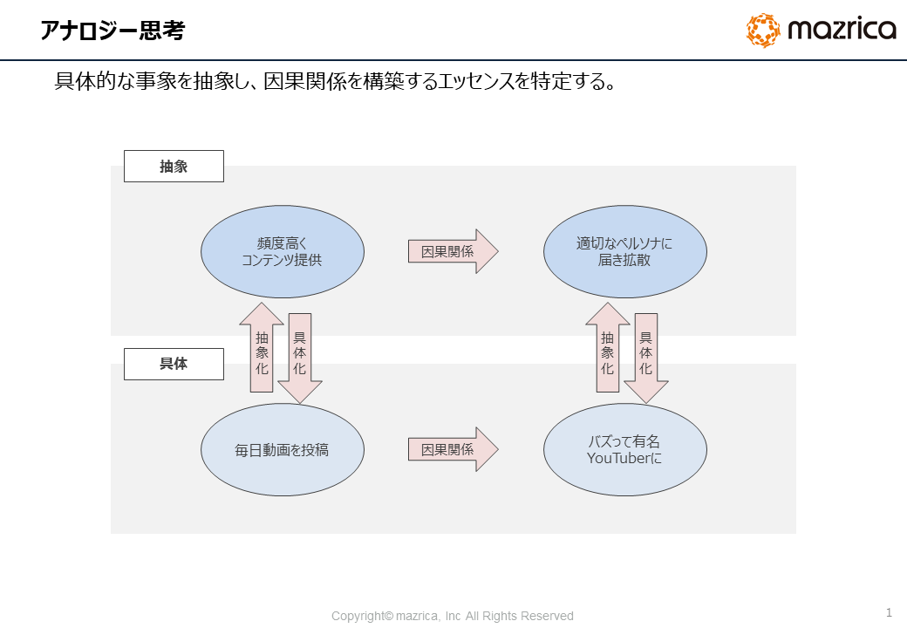
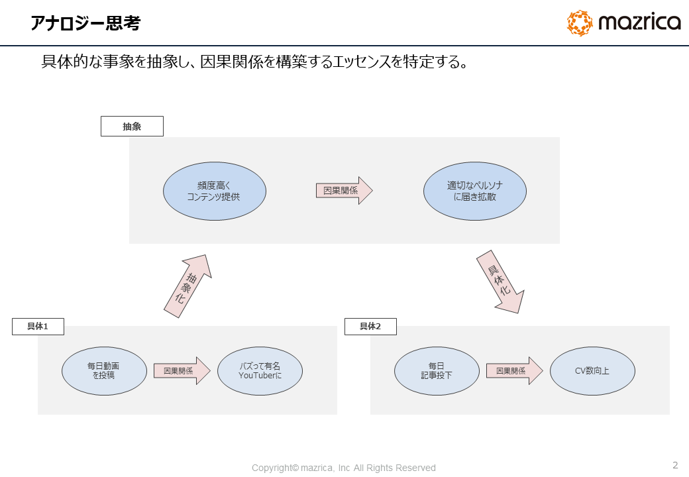
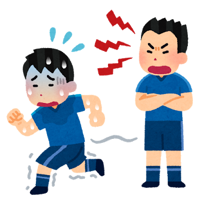
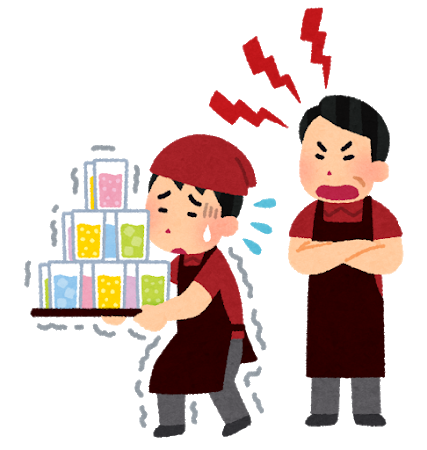
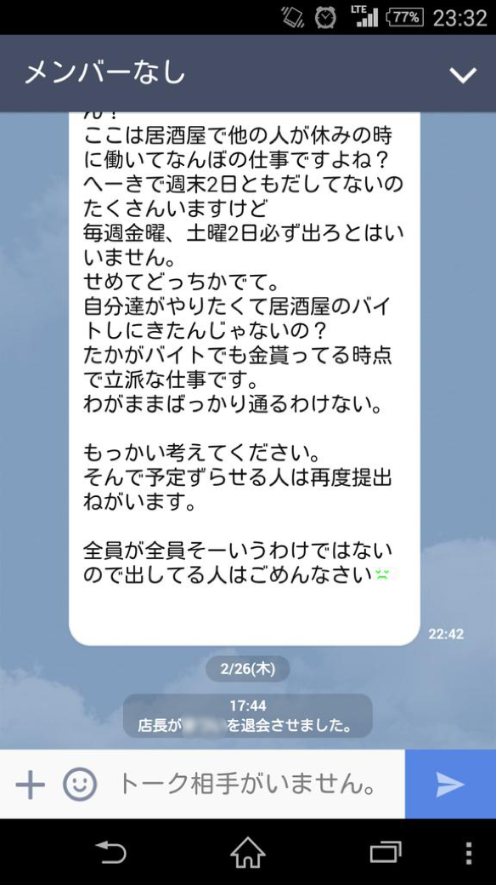
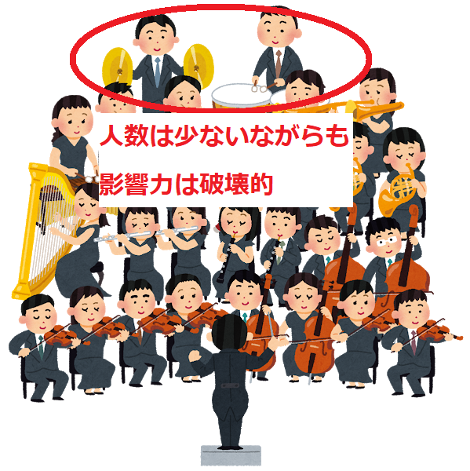

# 人生を少しでもイージーにする技術

人は日々、様々な**共同体**の中で生きています。
学校・部活・サークル・会社など、いつの間にか共同体に属してはその中に生かされています。

そのような共同体の中で、確実に「パワー」が存在するのではないかと気づきました。
そして、パワーを持つものは交渉力があり、持たざるものはそうでないという現実がある気がしたのです。

本稿では、僭越ながらパワーとはなんなのかを自身の事象から紐解き、「人生をもう少し生きやすくするためのTips」をお届けできればと思っています

<!-- [TOC] -->

## アナロジー思考を学んで他人の経験をフルに活かす

早速ですが、まず読者の皆様には「アナロジー思考」を身に着けて欲しいと思っています。
なぜなら、これを身につけることで学びの量が飛躍的に増加することが期待されることです。

具体的にアナロジー思考がどう役に立つのかを説明します。
次の段落では自身の体験談を紹介しようと思っています。
しかし、ただ体験談を語るだけでは「だからなに？」で終わってしまいます。
体験談からどんなエッセンスを得てどう自身の生活に活かしていくのか、を考えるための手段が**アナロジー思考**です。
この思考法は本稿を読むためのみならず、日常的に使える汎用的スキルなので習得して「百利あって一害なし」です。

では早速、アナロジー思考についてご説明します。

アナロジー思考とは、**これまでの情報や経験から得た学びを法則化し、異なる分野に応用する思考法**です。
これだけでは、わかりづらいと思うので例を用意しました。

　

例では下記のようなケースを想定します。

> 例：「毎日動画をアップしていたYouTuberがある日バズって成功した」をいう具体事象をもとに、マーケティング施策を考える。

### STEP①事象を抽象化する

Bさんはマーケティング部門の社員であり、日々自己研鑽を積む真面目な性格です。
アナロジー思考を用いて、YouTuberから学べることがあるのではないかと思い立ちました。
そんなストーリーとなっています。

さて、ではYouTuberとして活躍するAさんがいるとしましょう。
Aさんに成功の秘訣を聞くと、「質はともかく量を最優先して毎日動画投稿を欠かさなかった」とのことです。

これだけ聞いてもマーケティング施策に活かすことは難しそうです。

ここで、この事象をもう一段抽象化してみましょう。



「毎日動画を投稿」という事象を一段抽象化すると「高頻度でのコンテンツ提供」と言えるでしょう。

また、「バズって有名YouTuberになった」という事象を一段抽象化すると、「大人数に拡散された」ということに置き換えられるでしょう。


### STEP②他の事象に適用する

それでは、抽象化された概念を他の事例に転用してみましょう。

マーケティング部門ではオウンドメディアを運用しており、日々CV獲得（※注1）に向けて試行錯誤しています。

> 注1：Webサイトにおける目標の達成を指します。ここでは、簡単に「どれだけ申込みがあったか」の数という認識でOKです。


メディアにおいていままで記事の投稿は週に1回の頻度でした。
しかし、頻度を毎日に変更し、効果測定を週に1回設ける運用に変更しました。
すると、みるみるうちにPV数（※注2）は増大し、CVするようになりました。

> 注2：ページ閲覧数
>



## 「パワー」を学ぶための経験談2選

アナロジー思考を学んだ今、あらゆる話を自身に活かすことができるようになったかと思います。
では、私自身の経験談をご紹介します。

### 【成功例】退部者続出！鬼の吹奏楽部編

時代は高校時代にさかのぼります。

私は男子校に通っていました。もともと楽器の経験があったことを理由に吹奏楽部に入りました。


しかし、そこは入ってみるととんでもなく恐ろしいものでした。

罵声、怒声、胸ぐら、土○座・・・。
「文化部」という呼称を拭うには充分すぎる現場を目撃しました。

　

「音程合ってねぇじゃねえか！」「やる気あんのかよ！」

　

飛び交う顧問の怒声が耳を通じて頭の中に入ってきては、

　

「嗚呼帰りたい・・・辞めたい・・・。」

　

そう感じていました。



多くの吹奏楽部では夏のコンクールで賞を取ることを目指して活動します。
うちの部活も例に漏れずコンクールに出場していました。
コンクールにおいてはうちは強豪校に位置づけられているのですが、内情は顧問が部員を強制的にレベル上げしているからなのです。

そのため、「夏」は部員にとっては永遠に訪れてほしくない季節でした。

しかし、体調不良を起こす者や来なくなる者も続出するも、なんとかコンクールでは毎回金賞を取っていたので今考えると凄いものです。
そんな環境でしたが、私は結果辞めませんでした。
理由としては、もちろん自身が楽器が好きだったからという理由もあります。しかし、それよりも、そこまで顧問に怒られない地位を確立できたからです。

　

では、なぜ私はあまり怒られなかったのか？
その理由は後述します。

### 【失敗例】理不尽！ブラックバイト編

時代は大学時代に遡ります。
高校時代に部活しかしていなかった私はウェイ系大学生になることが急務でしたので、居酒屋でのアルバイトをはじめてみました。

飲食店でアルバイトした経験がある人はおわかりかと思いますが、

* ホール：接客や配膳、ドリンクづくり、食器の片付けを担う。
* キッチン：調理業務、皿洗いを担う。

という役割に分かれています。

私が勤務した店舗では「ホール」こそがキラキラの世界であり、「キッチン」はベテランにガン詰めされることが自然の理となっているようでした。
そして、料理なんてしたこともない私は「キッチン」に配属されました。
研修期間なんてものはなく、例に漏れず私もガン詰めの対象となってしまいました。



向上心はあっとういうまに削ぎ落とされた私は当時未熟だったもので、挨拶はしなくなり、土日のシフトも減らしていきました。（※注3）

> 注3：飲食店アルバイトをする上で土日のシフトに入らないのは罪悪とする習わしがある。

すると、いつの日にか店長からLINEのグループを退会をさせられたのでした。

## 考察

さて、2つ経験談を紹介しました。
吹奏楽部の例では、私がパワーを持っていたのでコンフォートゾーンを確立しつつ生活することができました。
後者はあまりにもパワーがなかったため、共同体から迫害を受けました。

この経験談からパワーとはなにかを考えていきたいと思います。

まず、先述した前者の例を補足させてください。
私は「打楽器」を担当していました。

吹奏楽やオーケストラを経験したことのない人はあまりイメージがつかないかもしれないのですが、打楽器は「人数が少ないが曲に与える影響がとてつもなく大きい」という側面を持ちます。



つまり、部活からしてみれば「私がいなくなること」は大きな意味を持ちました。
私がいなくなると「演奏できる曲が限られてしまう」「コンクールで賞を取りづらくなってしまう」などのデメリットが発生する可能性が高かったのです。
顧問からしてみても「私の退部」はどうしても避けたかったはずです。

つまり、私は顧問の先生と暗黙の安全保障条約を結ぶことで、過酷な部活の環境を生き抜くことができました。

後者の居酒屋アルバイトの例では、ガン詰めの洗礼に適応することができず、あえなく解雇されてしまいました。
これは、「私がいなくなること」の影響が小さいからです。

具体的には、私が一人やめたところで仕事は回るし、求人媒体に出していれば違う人からの応募もあるしで困ることがないのです。
そこで、私はこの「ひと1人が及ぼす影響力」はなにによって決定されるのかに興味を持ちました。
そしてひと1人が及ぼす影響力は**需要と供給のバランス**で決定されるという結論を持ちました。

前者の例では、「打楽器を演奏できる能力」が財として、需要と供給が存在していました。
吹奏楽部というチームは「打楽器を演奏できる人材は必須」を欲しているのに、その財を供給できるのは私しかおりませんでした。

　

式に表すと、

```
需要＞供給
```

ということです。

後者の例では、「メニューにある料理を適切に提供できる能力」が財として、需要と供給のバランスが存在していました。
つまり、店舗としては「キッチン業務を卒なくこなせる人材が必須」であり、その要件を満たせる可能性のあるひとは私以外にもいたということです。（※注4）

> 注4：アルバイトは正社員と比べても採用コストが低い。また部活の部員のように制約がないため調達しやすい。（部員は基本「本校の学生であること」などの制約が課されてしまう。）

式に表すと、

```
需要＜供給
```

ということです。

## 少しでも人生をイージーモードにするために

これからの人生を少しでもイージーモードにするためにはどうすれば良いのか？
仮に、パワーが需要と供給のバランスによって決定されるとすると、大切なことは2つです。

* 常に「周りがなにを求めているのか？」を考えること（需要の把握）
* 自己研鑽に努めること（供給力の増大）

この2つを意識すれば、生きやすい世の中にすることができるのではないかと思います。
私の後者の例では、アルバイトをあっけなく解雇されてしまいました。これはまだ笑い話になるのですが、笑えないケースもあります。

例えば、続々と発表される大手企業のシニアを対象とした早期退職勧告などはその例のうちの1つでしょう。

限定された視野で生きているといつの間にか需要の対象外人材となってしまい、人生ハードモードに突き落とされることもあるのです。
とはいえ、いつなにが起こるかは誰にもわからないので、難しいことは考えすぎず適当に生きるのが良さそうです。
